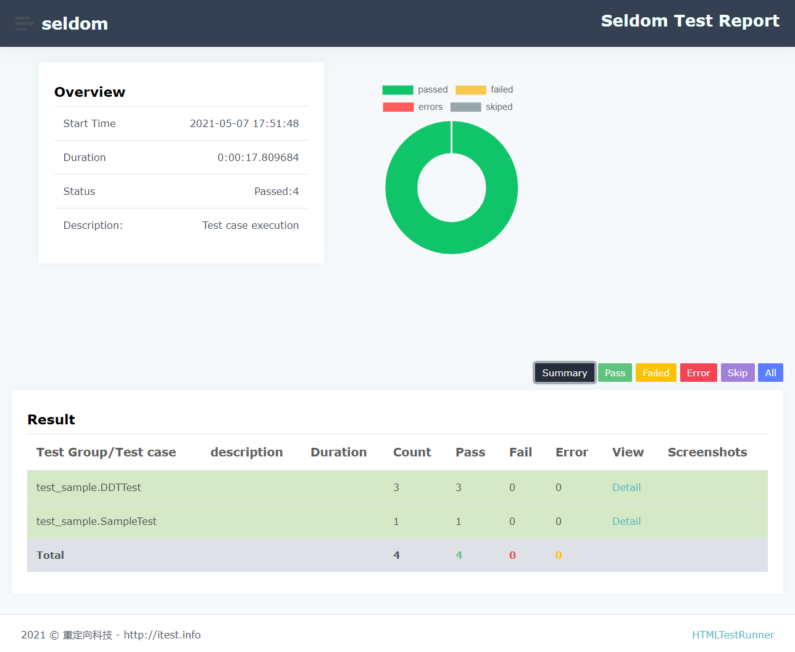

# pyse

WebUI automation testing framework based on Selenium and unittest.

> 基于 selenium 和 unittest 的 Web UI自动化测试框架。

## 特点

* 默认使用CSS定位，同时支持多种定位方法（id\name\class\link_text\xpath\css）。
* 基于Selenium二次封装，使用更简单。
* 提供脚手架，快速生成自动化测试项目。
* 自动生成/reports/目录，以及HTML测试报告生成。
* 自带断言方法，断言title、URL 和 text。
* 支持用例参数化。
* 只用用例失败重跑。
* 支持用例失败/错误截图。

### 安装

```shell
> pip install -U git+https://github.com/defnngj/pyse.git@master
```

### pyse命令

1、查看帮助：

```shell
> pyse -h
usage: pyse [-h] [-V] [--startproject STARTPROJECT] [-r R]

WebUI automation testing framework based on Selenium.

optional arguments:
  -h, --help            show this help message and exit
  -V, --version         show version
  --startproject STARTPROJECT
                        Specify new project name.
  -r R                  run test case
```

2、创建项目：

```shell
>pyse --startproject mypro

2019-11-07 00:24:57,783 - INFO - Start to create new test project: mypro

2019-11-07 00:24:57,784 - INFO - CWD: D:\

2019-11-07 00:24:57,785 - INFO - created folder: mypro
2019-11-07 00:24:57,786 - INFO - created folder: mypro\test_dir
2019-11-07 00:24:57,787 - INFO - created folder: mypro\reports
2019-11-07 00:24:57,788 - INFO - created file: mypro\test_dir\test_sample.py
2019-11-07 00:24:57,789 - INFO - created file: mypro\run.py
```

3、运行项目：

```shell
> cd mypro\
> pyse -r run.py
Python 3.7.1                                                                    

 ______  __   __  _______  _______                                              
|   _  ||  | |  ||  _____||   ____|                                             
|  |_| ||  |_|  || |_____ |  |____                                              
|   ___||_     _||_____  ||   ____|                                             
|  |      |   |   _____| ||  |____                                              
|__|      |___|  |_______||_______|                                                                                     
generated html file: file:///D:\mypro\reports\2019_11_12_22_28_53_result.html   
.1                                                                              
```

4、查看报告

你可以到 `mypro\reports\` 目录查看测试报告。



## API Documents

### simple demo

请查看 `test_sample.py` 文件

```python
import pyse

class BaiduTest(pyse.TestCase):

    def test_baidu(self):
        ''' baidu search key : pyse '''
        self.open("https://www.baidu.com/")
        self.type("#kw", "pyse")
        self.click("#su")
        self.assertTitle("pyse_百度搜索")

if __name__ == '__main__':
    pyse.main("test_sample.py", debug=True)
```

__说明：__

* 创建测试类必须继承 `pyse.TestCase`。
* 测试用例文件命名必须以 `test` 开头。
* 元素定位方式默认使用 CSS 语法 `#kw`, 也可以显示的使用 `css=>#kw`。
* pyse的封装了`assertTitle`、`assertUrl` 和 `assertText`等断言方法。
* 通过`main()`方法运行测试用例。

### API

pyse 提供的API

```py
self.accept_alert()

self.clear("css=>#el")

self.click("css=>#el")

self.click_text("新闻")

self.dismiss_alert()

self.double_click("css=>#el")

self.drag_and_drop("css=>#el","css=>#ta")

self.get_alert_text()

self.get_attribute("css=>#el","type")

self.get_display("css=>#el")

self.get_text("css=>#el")

self.get_title()

self.get_url()

self.js("window.scrollTo(200,1000);")

self.max_window()

self.move_to_element("css=>#el")

self.open("https://www.baidu.com")

self.open_new_window("link_text=>注册")

self.close()

self.quit()

self.refresh()

self.right_click("css=>#el")

self.screenshots('/Screenshots/foo.png')

self.select("#nr", '20')
self.select("xpath=>//[@name='NR']", '20')

self.set_window(wide, high)

self.submit("css=>#el")

self.switch_to_frame("css=>#el")

self.switch_to_frame_out()

self.type("css=>#el","selenium")

self.wait(10)

```

### main() 方法

```python
pyse.main(path="./",
          browser="chrome",
          title="百度测试用例", 
          description="测试环境：Firefox", 
          debug=True,
          rerun=0
)
```

说明：

* path ： 指定测试目录。
* browser: 指定测试浏览器，默认Chrome。
* title ： 指定测试项目标题。
* description ： 指定测试描述。
* debug ： debug模式，设置为True不生成测试HTML测试。
* rerun : 设置失败重新运行次数，默认为 0。

### Run the test

```python
pyse.main(path="./")  # 当前目录下的所有测试文件
pyse.main(path="./test_dir/")  # 指定目录下的所有测试文件
pyse.main(path="./test_dir/test_sample.py")  # 指定目录下的测试文件
pyse.main(path="test_sample.py")  # 指定当前目录下的测试文件
```

说明：

* 如果指定的目录，测试文件必须以`test` 开头。
* 如果要运行子目录下的文件，必须在子目录下加 `__init__.py` 文件。

### 支持的浏览器及驱动

如果你想指定测试用例在不同的浏览器中运行，非常简单，只需要在`pyse.main()`方法中通过`browser`设置。

```python

if __name__ == '__main__':
    pyse.main(browser="firefox")

```

支持的浏览器包括：`"chrome"`、`"firefox"`、`"ie"`、`"opera"`、`"edge"`、`"chrome_headless"` 等。

不同浏览器驱动下载地址：

geckodriver(Firefox):https://github.com/mozilla/geckodriver/releases

Chromedriver(Chrome):https://sites.google.com/a/chromium.org/chromedriver/home

IEDriverServer(IE):http://selenium-release.storage.googleapis.com/index.html

operadriver(Opera):https://github.com/operasoftware/operachromiumdriver/releases

MicrosoftWebDriver(Edge):https://developer.microsoft.com/en-us/microsoft-edge/tools/webdriver

==========================================================

### 元素定位

pyse支持多种定位方式，id、name、class、link text、xpath和css。把定位方法与定位内容一体，写起更加简洁。

```html
<form id="form" class="fm" action="/s" name="f">
    <span class="bg s_ipt_wr quickdelete-wrap">
        <input id="kw" class="s_ipt" name="wd">
```

定位方式（推荐使用 CSS）：

```python
# 默认支持CSS语法
self.type(".s_ipt","pyse")     #css
self.type("#su","pyse")        #css

# id
self.type("id=>kw", "pyse")  #id

# class name
self.type("class=>s_ipt", "pyse")  #class定位

# name
self.type("name=>wd", "pyse")  #name

# xpath
self.type("xpath=>//*[@class='s_ipt']","pyse")  #xpath
self.type("xpath=>//*[@id='kw']","pyse")        #xpath

# link text
self.click_text("新闻") #link text (点击百度首页上的"新闻"链接)

```

css选择器参考手册：
http://www.w3school.com.cn/cssref/css_selectors.asp

### 参数化测试用例

pyse 支持参数化测试用例，集成了[parameterized](https://github.com/wolever/parameterized)。

```python

import pyse
from pyse import ddt


class BaiduTest(pyse.TestCase):

    @ddt.data([
        (1, 'pyse'),
        (2, 'selenium'),
        (3, 'unittest'),
    ])
    def test_baidu(self, name, keyword):
        """
         used parameterized test
        :param name: case name
        :param keyword: search keyword
        """
        self.open("https://www.baidu.com")
        self.clear("id=>kw")
        self.type("id=>kw", keyword)
        self.click("css=>#su")
        self.assertTitle(keyword)

```
