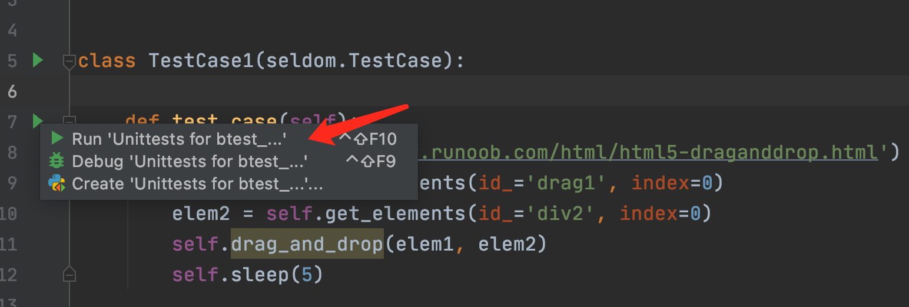

## 其他


### 指定不同的浏览器

我们运行的自动化测试不可能只在一个浏览器下运行，我们分别需要在chrome、firefox浏览器下运行。在seldom中需要只需要修改一个配置即可。

```python
import seldom

# ……

if __name__ == '__main__':
    seldom.main(browser="chrome") # chrome浏览器,默认值
    seldom.main(browser="firefox") # firefox浏览器
    seldom.main(browser="ie")  # IE浏览器
    seldom.main(browser="opera") # opera浏览器
    seldom.main(browser="edge") # edge浏览器
    seldom.main(browser="safari") # safari浏览器
```

在`main()`方法中通过`browser`参数设置不同的浏览器，默认为`Chrome`浏览器。


### Mobile Web 模式

seldom 还支持 Mobile web 模式：

```python
import seldom

#...

if __name__ == '__main__':
    seldom.main(browser="iPhone 6") # iPhone 6 手机浏览器展示
```

支持的设备类型，如下：

```python

PHONE_LIST = [
    'iPhone 5', 'iPhone 6', 'iPhone 7', 'iPhone 8', 'iPhone 8 Plus',
    'iPhone X', 'Pixel 2', 'Pixel XL', "Galaxy S5"
]
PAD_LIST = ['iPad', 'iPad Pro']

```

### 开启headless模式

Firefox和Chrome浏览器支持`headless`模式，即将浏览器置于后台运行，这样不会影响到我们在测试机上完成其他工作。

```python
import seldom
from seldom import ChromeConfig

#...

if __name__ == '__main__':
    ChromeConfig.headless = True
    seldom.main(browser="chrome")
```

只需要将 ChromeConfig 类中的 headless 设置为 `True`即可， Firefox浏览器配置方法类似。

### 开放浏览器配置能力

seldom为了更加方便的使用驱动，屏蔽了浏览器的配置，为了满足个性化的需求，比如禁用浏览器插件，设置浏览器代理等。所以，通过ChromeConfig类的参数来开放这些能力。

例如，浏览器忽略无效证书的问题。

```python
import seldom
from seldom import ChromeConfig
from selenium.webdriver import ChromeOptions


if __name__ == '__main__':
    chrome_options = ChromeOptions()
    chrome_options.add_argument('--ignore-certificate-errors')  # 忽略无效证书的问题
    ChromeConfig.options = chrome_options
    seldom.main(browser="chrome")
```

将要`ChromeOption`添加的设置赋值给`ChromeConfig`的`options`变量。


### Selenium Grid

首先，安装Java环境，然后下载 `selenium-server`。

```shell
> java -jar selenium-server-standalone-3.141.59.jar

12:30:37.138 INFO [GridLauncherV3.parse] - Selenium server version: 3.141.59, revision: e82be7d358
12:30:37.204 INFO [GridLauncherV3.lambda$buildLaunchers$3] - Launching a standalone Selenium Server on port 4444
2020-10-10 12:30:37.245:INFO::main: Logging initialized @301ms to org.seleniumhq.jetty9.util.log.StdErrLog
12:30:37.417 INFO [WebDriverServlet.<init>] - Initialising WebDriverServlet
12:30:37.497 INFO [SeleniumServer.boot] - Selenium Server is up and running on port 4444
```

```python
import seldom
from seldom import ChromeConfig

# ……
if __name__ == '__main__':
    ChromeConfig.command_executor = "http://127.0.0.1:4444/wd/hub"
    seldom.main(browser="chrome")

```

* 设置远程节点，[selenium Grid doc](https://www.selenium.dev/documentation/en/grid/)。


### 在pycharm中运行测试

1. 配置测试用例通过 unittest 运行。


2. 在文件中选择测试类或用例执行。

 

> 警告：运行用例打开的浏览器，需要手动关闭， seldom不做用例关闭操作。
