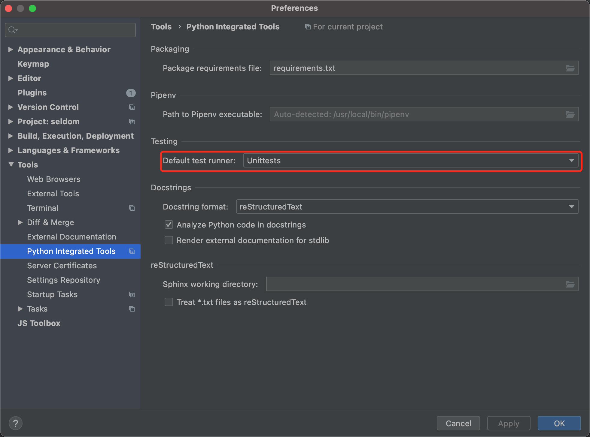

## 运行自动化项目

> Window建议使用cmder, mac/linux使用自带终端。

### 在终端下运行（推荐）

创建 `run.py` 文件，在要文件中引用`main()`方法，如下：

```py
import seldom

# ...

seldom.main()    # 默认运行当前文件中的用例。
seldom.main(path="./")  # 指定当前文件所在目录下面的用例。
seldom.main(path="./test_dir/")  # 指定当前目录下面的test_dir/ 目录下面的用例。
seldom.main(path="./test_dir/test_sample.py")  # 指定测试文件中的用例。
seldom.main(path="D:/seldom_sample/test_dir/test_sample.py")  # 指定文件的绝对路径。
```

`main()`方法默认运行当前文件中的用例，显然当前文件中没有测试用例。可以通过`path`参数指定运行其他文件中的用例。

打开在cmder/终端下面运行 `run.py` 文件

```shell
> python run.py
```

或者：

```shell
> seldom -r run.py
```


### 运行单个测试类、方法

在调试阶段，需要运行单个测试类或方法。

```shell script
> cd test_dir/
> seldom -m test_sample.SampleTest.test_case
Runtime environment:
---------------------
Note: This mode is suitable for debugging single test classes and methods.
Python 3.7.9
seldom 1.10.0
Browser: Chrome(default)
---------------------
2021-01-29 18:59:53 [INFO] 👀 assertIn url: http://www.itest.info/.
.
----------------------------------------------------------------------
Ran 1 test in 18.497s

OK
``` 

* 运行粒度

```shell script
> seldom -m test_sample # 运行 test_sample.py 文件
> seldom -m test_sample.SampleTest # 运行 SampleTest 测试类
> seldom -m test_sample.SampleTest.test_case # 运行 test_case 测试方法
```

> 警告：如果测试方法 使用了`@data`、`@file_data` 装饰器，则不支持指定测试方法执行。

## 在pycharm中运行

1. 配置测试用例通过 unittest 运行。



2. 在文件中选择测试类或用例执行。

 

备注：运行用例打开的浏览器，需要手动关闭， seldom不做用例关闭操作。
